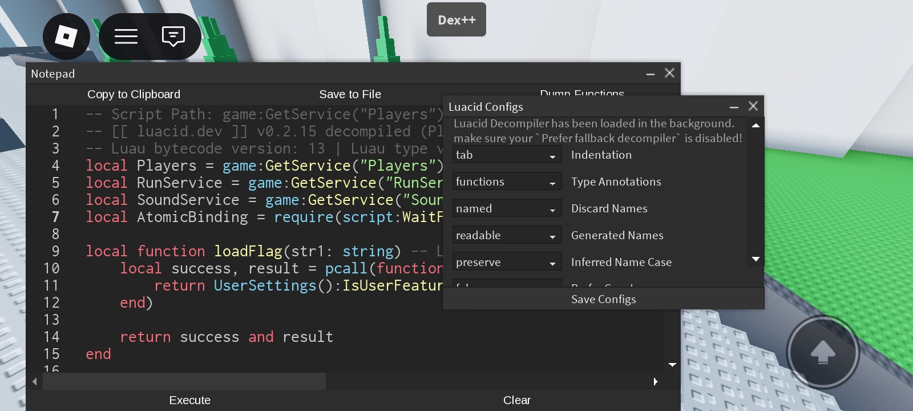

# Luacid Decompiler Plugin

a plugin that automatically installs the [luacid](http://luacid.dev/) decompiler. it also gives you a menu with a bunch of configurations that let you change how the decompiler decompiles. to learn about each setting goto https://luacid.dev/docs/decompile

# using the keyed version
by default this plugin uses the **Free/Keyless** version of luacid. but if you have a **Key** (an AD-Key or a Paid Key) and want to use it you need to edit the plugin file it self
open the plugin file `LuacidPlugin.luau` and you'll see a
```Luau
local LUACID_KEY = "NO_KEY"
```
Replace `"NO_KEY"` with your key like:
```Luau
local LUACID_KEY = "KEY_6767"
```
the next time you open dex ill automatically use that key and if you want to back to the keyless version just change it back to `"NO_KEY"`
**again** only change this is if you want to use the keyed version of luacid. you don't need todo any of this

# Factory Reset
if you ever messed with the settings so much so you forgot which one you changed you can reset to the default settings by deleting the `LuacidConfigs.json` that is created in your executor workspace folder

# Credits
Plugin Creator: [Roblox-HttpSpy](https://github.com/Roblox-HttpSpy)

Decompiler: https://luacid.dev/
